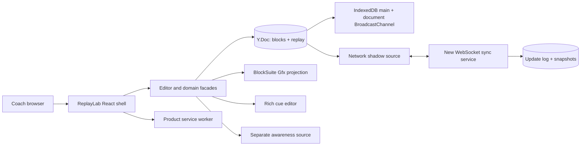

# ReplayLab target architecture

Статус: implemented through Slice 7; immediate-tab-close durability regression resolved by emergency journal v1 (2026-09-08); public release awaits external/manual gates
Upstream baseline: `329839e467d936f90230fb02a8983f8eb4b62fc0`

## 1. Architecture goals

Release hardening decision (2026-09-08): the product's IndexedDB adapter retains the approved collection schema, explicitly commits writes with strict durability and awaits transaction completion before acknowledgement/broadcast. Local open and flush wait for the main IndexedDB peer, never a network shadow. The owner subsequently authorized emergency recovery journal v1: see `EMERGENCY_JOURNAL.md` for backup-before-adoption, per-writer slots, observed-draft tombstones, version/corruption/quota policy and unchanged canonical schema. Synchronous event-time capture closes the pre-IndexedDB-ACK crash window. The original immediate-close test remains unchanged and passes ten repetitions; renderer-crash, corrupt/future-version, interrupted adoption, cross-tab draft and merged-schema-cap tests pass. Neither browser storage erasure nor complete media failure is claimed lossless.

1. Один canonical collaborative model для court и rich cues.
2. Local load/save раньше network readiness.
3. Realtime convergence без отмены remote edits локальным undo.
4. Playback и pointer drafts не создают CRDT traffic.
5. BlockSuite editor/Gfx сложность сохраняется, AFFiNE shell/protocol не переносится.
6. Semantic conflicts видимы и разрешимы.
7. Canvas имеет эквивалентный DOM/keyboard path.
8. Upstream churn изолирован facade layer.

## 2. Key decisions

| ID | Decision | Rationale |
|---|---|---|
| A-01 | Новый React shell, без `@affine/core` | убрать business/cloud/workspace coupling |
| A-02 | BlockSuite Store/Std/Sync/Gfx behind facade | сохранить CRDT editor, commands, undo and rendering |
| A-03 | Один Y.Doc на play, без subdocs в v1 | bounded artifact; проще migration/recovery |
| A-04 | IndexedDB — main source, network — shadow | local readiness не зависит от сети |
| A-05 | Domain keyframes — canonical; current pose — derived | scrub/playback не записывает CRDT updates |
| A-06 | Product-owned Gfx projection elements/tools | использовать viewport/grid/layers без standard-shape source of truth |
| A-07 | One undo manager for blocks + replay root | single capture units across court/cue and local-only history |
| A-08 | Critical values use multi-value registers | Yjs convergence alone does not expose semantic conflicts |
| A-09 | Product-owned network protocol/server | no AFFiNE backend/protocol dependency |
| A-10 | DOM semantic companion is part of core | canvas accessibility cannot be retrofitted late |

## 3. System context



The client owns play projection and commands. The server never authors tactics, but it does enforce a versioned structural schema and hard caps: each proposed update is size-checked, applied to an isolated room clone, validated, and only then acknowledged/fanned out.

Release verification correction (2026-09-08): `ReplayLabEditorFacade.flush` waits only for the IndexedDB main peer, not `DocEngine.waitForSynced` across all shadows. A disconnected capability room therefore opens/reloads from its local copy without waiting for the network. Abort and shutdown remove status subscriptions. The production-server offline-reload regression covers this distinction.

## 4. Proposed package boundaries

Future paths are design targets, not files created by this audit:

```text
packages/replaylab/domain        # commands, migrations, conflict projection
packages/replaylab/schema        # portable structure/caps validator
packages/replaylab/editor        # BlockSuite facade, cue block, Gfx adapters
packages/replaylab/web           # React shell, routes, design system, SW
packages/replaylab/sync-protocol # original envelopes, capabilities, versions
packages/replaylab/sync-client   # network DocSource and awareness source
packages/replaylab/sync-server   # independent protocol, ACL, persistence
packages/replaylab/test-kit      # fixtures, replica simulator, perf scenes
```

Dependency rules:

```text
web -> editor -> domain -> schema
web -> sync-client -> sync-protocol
sync-server -> sync-protocol
sync-server -> schema (structural validation/caps only)
test-kit -> all public boundaries
```

Only `editor` may import BlockSuite editor/store packages; only `sync-client` may import the allowlisted `@blocksuite/sync` facade and speak the product network protocol. `sync-server` never imports ReplayLab commands/projections. `web` never reaches Yjs internals directly.

## 5. Canonical document model

```text
Y.Doc guid = play:<playId>
├─ yBlocks                         # BlockSuite rich cue tree
└─ replay: Y.Map
   ├─ schemaVersion: number
   ├─ meta: Y.Map
   ├─ actors: Y.Map<actorId, Actor>
   ├─ frames: Y.Map<frameId, Frame>
   └─ actions: Y.Map<actionId, Action>
```

### Root and meta

- `affine:page.props.title` is the single canonical title; any URL/catalog label is a derived cache;
- court preset is the schema constant `'basketball-half-court'` in v1, not mutable document state;
- `direction: 'left-to-right' | 'right-to-left'`;
- created/updated provenance metadata.

### Actor

- immutable `id`;
- `kind: 'player'`;
- `team: 'offense' | 'defense'`;
- jersey number and short label;
- display token shape/color;
- bounded display metadata.

There are exactly ten actor records, five per team. The ball is a fixed derived render entity, not an actor/roster record. No roster/profile/account reference exists in v1.

### Frame

- immutable `id`;
- fractional `rank`; canonical order is `(rank, immutableFrameId)`;
- `durationMs` and `holdMs`;
- full `poses: Y.Map<playerId, PoseRegister>` for all ten players;
- `possession: MVRegister<playerId | 'loose'>`;
- one `looseBallPose: PoseRegister` only when possession is `loose`; otherwise ball position derives from the possessor;
- `cueBlockId`;
- soft archived flag.

Each frame stores all ten player poses. Sparse inheritance is intentionally rejected: at 10 players × 12 frames its complexity costs more than its storage savings.

### Action

- immutable `id`;
- adjacent `fromFrameId` and `toFrameId`;
- `actorId`;
- `type: 'cut' | 'dribble' | 'pass' | 'screen'`;
- optional `targetActorId`;
- `path: MVRegister<PathCandidate>`, where each immutable candidate contains normalized court points;
- soft archived flag.

An action never spans more than one adjacent transition in v1.

### Rich cue

`replay:cue` is a product-owned BlockSuite block containing paragraph/list children and inline formatting/link. Frame creation and cue creation are one validated command and one observer/history unit. The frame references `cueBlockId`; cue deletion is soft until invariant repair completes.

## 6. Semantic multi-value register

Critical scalar/geometry values use a candidate set:

```text
Register
└─ candidates: Y.Map<candidateId, { value, actorId, commandId }>
```

Command protocol:

1. Read and remember candidate IDs visible at command start.
2. Commit removes only the candidates that were observed.
3. Commit adds one globally unique candidate.
4. Concurrent unseen candidates survive merge.
5. Projection chooses a deterministic display winner but exposes every live alternative.
6. Resolution removes only the candidates observed by that command and adds one new immutable selected/derived candidate.
7. Concurrent resolutions therefore survive as candidates instead of collapsing through a hidden LWW pointer.

Critical registers:

- player pose or loose-ball pose per frame;
- possession;
- action path;

`Y.Text` cues use normal collaborative merge. Frame rank uses deterministic `(rank, id)` ordering; duration, archived flags and low-risk labels/styles use bounded Yjs map semantics plus validation badges where needed. Automated compaction never deletes unresolved candidates.

## 7. State layers

| Layer | Examples | Technology/owner |
|---|---|---|
| Canonical collaborative | actors, frames, actions, cues | Yjs + BlockSuite Store |
| Server authority | token hashes, read/write role, retention | new sync server |
| Derived projection | sorted frames, resolved poses, conflicts | product external store |
| Interaction FSM | drag, draw, scrub, edit, modal | local product controller |
| Render drafts | pointer path, interpolated pose | Gfx local elements/signals |
| Awareness | cursor, selection, gesture ghost, presenter | y-protocols awareness |
| Preferences | pane, theme, last tool, reduced motion | local storage |
| URL | play id, frame id, pane/present mode | React Router |

React consumes projection slices via `useSyncExternalStore` or an equivalent fine-grained selector. It never mirrors canonical entities into a second mutable store.

## 8. Command and transaction layer

All durable writes use typed commands:

- `createFrameAfter`;
- `renamePlay`;
- `setActorPose`;
- `setLooseBallPose`;
- `setPossession`;
- `createAction` / `replaceActionPath`;
- `reorderFrame`;
- `archiveEntity` / `restoreEntity`;
- `resolveConflict`;
- `createCue` / cue block commands.

Each command:

1. constructs and fully validates every fallible draft/precondition before mutation;
2. starts one Yjs transaction with explicit origin whose callback is required to be non-throwing;
3. updates replay and blocks as one observer/history unit when required;
4. emits derived invalidation after commit;
5. defines one undo capture boundary;
6. returns a domain event for accessibility/telemetry.

Yjs/BlockSuite transactions do not provide application rollback; “atomic” in this design means one transaction/history notification, not rollback after an exception. Slice 0 tests `command throws before transact -> next command/history remains correct` and records whether the audited `withoutTransact` path is pinned, patched upstream, or avoided.

Pointermove, hover, viewport, playhead and awareness never call durable commands.

## 9. Unified local-only undo

Use the BlockSuite/Yjs `UndoManager` already created for `yBlocks`, then add the `replay` root to its scope.

Rules:

- track only local document client origin;
- exclude remote, migration, projection and system-repair origins;
- keep actor drag/path drawing in local draft until gesture end;
- commit one command at pointerup/drop;
- call history capture boundary before/after compound gestures;
- do not track scrub, selection, viewport or presenter follow;
- cue + frame creation remains one validated capture unit; automatic repair is outside local user history.

Phase 0 must prove this through public/stable APIs. Failure inside the timebox triggers the documented fallback; it does not authorize patching AFFiNE backend or copying its shell.

## 10. BlockSuite Gfx projection

The standard surface CRDT shapes are not the source of truth for keyframes. Instead:

1. `ReplayProjection` resolves the current/next frame and playhead.
2. Product-owned actor/action element models are inserted as local Gfx projection elements.
3. Gfx viewport, grid, layers, selection, hit testing and CanvasRenderer remain active.
4. Product-owned renderers draw court, actors, paths, conflicts and presence overlays.
5. Product-owned tools translate pointer/keyboard gestures into domain commands.
6. A completed gesture replaces projection from canonical Yjs state.

The static court is cached in an offscreen/bitmap layer. Interpolated positions are calculated per animation frame and never written into `xywh` or Yjs.

API-risk control: all Gfx integration lives behind `ReplayLabGfxAdapter`; pinned compatibility tests fail loudly on upstream changes.

## 11. Rich editor integration

- Stable Lit custom-element host mounted inside React; scrub does not remount it.
- Only selected BlockSuite blocks are registered.
- Cue selection and court selection share one input coordinator.
- Opening cue editing suspends court shortcuts.
- Cross-frame navigation commits composition first and preserves IME behavior.
- Slash/menu UI must provide real listbox/menu semantics rather than inheriting the current visual-only pattern.

## 12. Local-first lifecycle

```text
open route
  -> load app shell
  -> open IndexedDB main source
  -> load/migrate Y.Doc
  -> render editable local play
  -> use IndexedDBDocSource internal BroadcastChannel for document cross-tab updates
  -> connect separate BroadcastChannel awareness source
  -> connect network shadow
  -> reconcile and report sync state
```

Status semantics:

- `Loading local` — no editable model yet;
- `Saved locally` — main source accepted all local commands;
- `Sync pending` — network shadow has outstanding work;
- `Synced` — all connected shadows report caught up;
- `Offline` — local editing remains available;
- `Sync blocked` — a terminal network error stopped only the shadow; IndexedDB remains authoritative and export/re-authorize actions are visible;
- `Needs review` — convergence succeeded but semantic candidates conflict.

New hardening absent from the AFFiNE baseline:

- bounded `pagehide` flush;
- app-shell service worker;
- persistent-storage request/UX;
- quota/corruption recovery;
- non-destructive migrations and an immutable `RecoveryStore`;
- cold-offline E2E.

`RecoveryStore` keeps versioned encoded Yjs snapshots before migration and at bounded checkpoints. It is a backup/export boundary, never a second mutable source of truth. This is product-owned because the audited `IndexedDBDocSource` compacts its update records and does not retain a last-valid historical copy.

## 13. Network source and protocol

`ReplayNetworkDocSource` implements the generic BlockSuite `DocSource` contract:

- `pull(docId, stateVector)` returns missing Yjs update and server state;
- `push(docId, update)` is idempotent;
- `subscribe` streams remote updates and reports disconnect;
- awareness uses a separate source/channel.

Protocol is product-owned and specified before implementation. Suggested message families, intentionally unrelated to AFFiNE events:

- `HELLO` / `READY`;
- `DIFF_REQUEST` / `DIFF_RESPONSE`;
- `UPDATE_COMMIT` / `UPDATE_ACCEPTED` / `UPDATE_FANOUT`;
- `PRESENCE_JOIN` / `PRESENCE_UPDATE` / `PRESENCE_LEAVE`;
- `ERROR_RETRYABLE` / `RATE_LIMITED` / `ERROR_TERMINAL`.

Transport requirements:

- TLS only outside local development;
- bounded update and awareness payloads;
- schema/version negotiation;
- request timeouts and abort support;
- an explicit browser `online` signal that immediately restarts the sync facade, followed by jittered exponential backoff for repeated failure;
- typed error classification: timeout/disconnect/rate-limit is retryable (honor `Retry-After`); auth/revocation/schema/oversize is terminal;
- duplicate update safety;
- no AFFiNE endpoints, event names, auth or compatibility mode.

The immediate restart is required for the three-second reconnect target: the audited generic peer otherwise has a fixed five-second retry delay. If Slice 5B cannot prove the immediate facade path, the published gate becomes eight seconds rather than making a false three-second claim.

The audited generic peer retries every rejected push, so terminal behavior cannot be represented by repeatedly rejecting `push()`. `NetworkShadowController` classifies the protocol response, synchronously stops/destroys only that shadow, and owns the product sync status. IndexedDB/Y.Doc remains intact; the UI shows `Sync blocked` plus export/re-authorize. Generic `Synced` is ignored while blocked. After authorization/schema recovery, a new peer is created and computes a fresh state-vector diff from the authoritative local document.

## 14. Sync server

V1 is a single-region deployment with one process owning a room at a time and multiple authorized collaborators:

- opaque `roomId`;
- separate read and write capability tokens, transmitted from URL fragment by the client and stored hashed server-side;
- WebSocket room fanout;
- append-only Yjs update log;
- periodic compact snapshot and state vector;
- before ACK/fanout, reject oversized updates, apply each update to an isolated clone of current room state, and validate schema/caps;
- retention window and explicit export before deletion;
- read-only subscribers cannot push;
- per-room connection/update rate limits;
- structured logs without document content.

No accounts, SSO, teams, billing, horizontally distributed rooms or AFFiNE server compatibility. Read capability also opens the client Store/command bus in read-only mode; a deliberate local fork is a future feature.

## 15. Awareness model

### Slice 7 standalone server decision (2026-09-08)

The existing product-owned room/protocol runs beside the HTTP static server on port 32400 (`/sync`). Local verification listeners use only 32400–32499. No new backend dependency, protocol envelope, client canonical schema or second collaborative document was introduced.

The previously in-memory server proof now accepts an injected durable append operation. After isolated-clone validation and before canonical apply/ACK/fanout, the standalone implementation fsyncs a checksummed update journal. Failure is retryable and leaves the trusted room unchanged. Replay is idempotent; a corrupt complete record blocks startup, while an unacknowledged incomplete tail is preserved as a recovery artifact before truncation. Every 100 commits writes an optional compact snapshot; the retained full journal remains restart authority. No automatic retention deletion is implemented. Room limits and operator backup/restore instructions are in `RELEASE.md`.

Provisioning is an offline administrator CLI, with exclusive creation of room configuration and only capability hashes persisted. One server process owns a data directory. Browser IndexedDB remains authoritative; this durability strengthens only the network shadow. Public HTTPS, host backups, mark/domain clearance and real screen-reader/demo review remain external release gates. Adversarial pre-ACK disk-failure and restart/corruption tests are in `release-server.e2e.spec.ts`.

Presence may contain:

- participant id/name/color;
- selected frame, actors and action;
- editor selection payload;
- active tool;
- throttled gesture draft (max 20 Hz);
- presenter playhead (max 10 Hz);
- explicit follow-presenter state.

Presence never contains permissions, durable positions or locks. Concurrent edits are allowed and reconciled semantically.

## 16. Rendering and performance

Principles:

- normalized court coordinates in canonical state;
- cached static court layer;
- invalidation-driven render, continuous RAF only for gesture/playback/presence;
- no React state update on pointermove or animation tick;
- Yjs observer changes coalesced to one paint per frame;
- direct scan is sufficient for ten player actors plus the derived ball; Gfx grid remains available for paths/overlays;
- limited Bézier pass animation; no physics;
- conflict candidates render on a separate ghost layer;
- stable cue editor host and lazy-loaded noncritical panels.

Budgets are normative in [TRANSFORMATION_SPEC.md](./TRANSFORMATION_SPEC.md) and tested on a maximum fixture.

## 17. Input and accessibility architecture

`InputCoordinator` owns focus and shortcut contexts. Handler results are explicit:

```ts
type InputResult = 'ignored' | 'handled' | 'handled-and-prevented';
```

The semantic companion reads the same projection as canvas:

- ordered frames;
- lineup table;
- action list/descriptions;
- keyboard position/path dialogs;
- native transport controls;
- polite announcements based on committed domain events.

It does not inspect pixels or duplicate model state. Reduced motion changes projection/playback policy, not just CSS.

## 18. Routing

```text
/demo/play/:playId
/app/play/:playId/edit?frame=<id>&pane=court|notes|split
/app/play/:playId/present?frame=<id>
```

Viewport and continuously changing playhead are not written to URL. `frame` updates only after an intentional phase selection. Presenter follow is awareness state, not routing state.

## 19. Migrations and recovery

- `schemaVersion` is part of the document.
- Migrations are deterministic, idempotent and run on a clone first.
- Before migration, `RecoveryStore` writes an immutable encoded snapshot with schema/version/checksum.
- Previous IndexedDB database remains intact until migrated copy validates and opens successfully.
- Server stores accepted update bytes/snapshots and a materialized validation clone; client owns semantic migration/projection.
- Unsupported future schema opens read-only with export.
- Hard delete is unavailable until retention and restore semantics are implemented.

## 20. Security and privacy

- Treat Yjs updates and rich cues as untrusted input.
- Sanitize rich content through an allowlisted BlockSuite API or an independently licensed dependency that has passed the provenance gate, plus a strict CSP; never import AFFiNE frontend packages for sanitization.
- Validate limits after applying to an isolated Y.Doc before accepting server compaction.
- Limit actors, frames, actions, points, cue size and update bytes.
- Never log room tokens or cue content.
- Keep tokens out of query strings/referrers.
- Separate read and write capabilities.
- Include dependency/SBOM and provenance gates in CI.

E2EE is not promised in v1; claiming it would conflict with server-side validation and recovery design.

## 21. Test architecture

### Domain and CRDT

- property tests over 2–3 replicas with shuffled/duplicated updates;
- offline partitions and convergence;
- multi-value pose/possession/path conflict cases;
- orphan/archive repairs;
- deterministic migrations and snapshot fixtures;
- local-only undo across blocks + replay root.
- rename, player-pose and loose-ball-pose command/undo coverage.
- pre-transaction exception followed by a correct command/history operation.

### Browser

- Playwright multi-context realtime;
- IndexedDB reload and its internal document-BroadcastChannel convergence;
- late-opening tab receives current awareness after its collection handshake;
- offline edit, cold reload, reconnect and review;
- keyboard-only authoring;
- tablet actor reposition/cue edit and mobile read/review;
- conflict resolution and presenter follow;
- axe plus manual screen-reader smoke tests.

### Server

- state-vector diff and duplicate update;
- read/write authorization;
- oversized/malformed/structurally invalid update rejected before ACK/fanout;
- timeout/reconnect/rate limit;
- retryable error honors backoff/Retry-After; terminal auth/schema/oversize stops the shadow, makes no repeated push, preserves local state and never reports `Synced`;
- compaction/snapshot restore;
- abrupt process restart and retention.

### Performance and visual

- deterministic max fixture;
- frame-time/input latency measurement;
- route open/close memory regression;
- DPR/theme/high-contrast/conflict ghost visual snapshots.

## 22. Observability

New product-owned diagnostics:

- local load/migration duration;
- pending local/network queue sizes;
- reconnect attempts and sync latency;
- semantic conflict count;
- renderer frame time and dropped frames;
- recovery/export events;
- error boundary fingerprints without document content.

Telemetry is opt-in for public builds and never required for core functionality.

## 23. Architecture kill criteria

- No unified undo through supported extension points after five working days: stop and evaluate Incident Replay.
- Direct extension composition still ships most unused AFFiNE blocks above the bundle budget: timebox slim-root work; do not expand indefinitely.
- Custom network source exceeds its ten-day slice: adopt a separately licensed upstream Yjs provider behind the same facade, never AFFiNE protocol.
- Tablet light editing or mobile review fails touch/accessibility budgets: reduce within the fixed responsive matrix; never claim full mobile authoring.
- Canvas companion cannot cover a critical command: that command is not production-ready.

## 24. Architecture traps

- persisting interpolated/current positions;
- using standard surface shape `xywh` as keyframe truth;
- CRDT writes on pointermove;
- separate undo histories for court and cues;
- mirrored canonical React state;
- awareness as lock/permission;
- silent last-writer wins for critical poses;
- automatic deletion of orphan actions;
- live physics/auto-layout;
- network storage as main source;
- umbrella AFFiNE shell for convenience;
- direct imports from unstable BlockSuite internals outside facade;
- accessibility as final polish.
